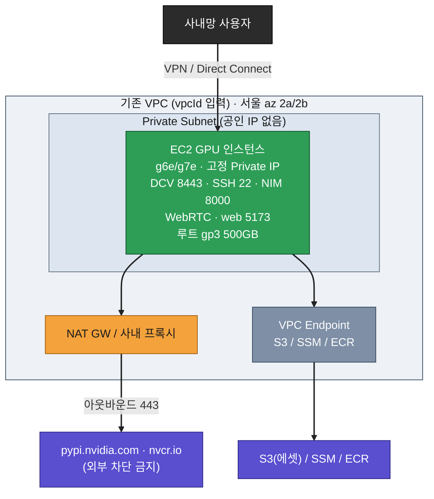
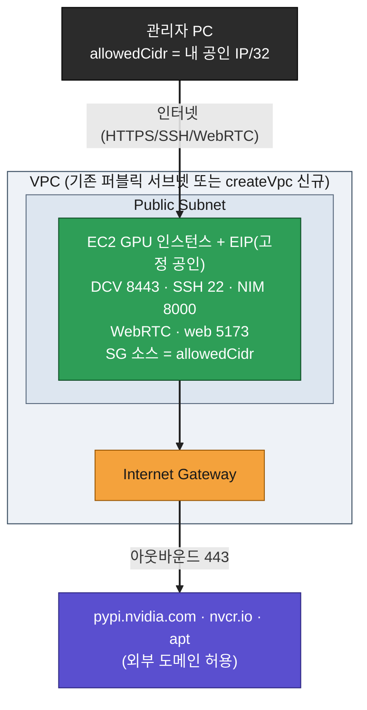
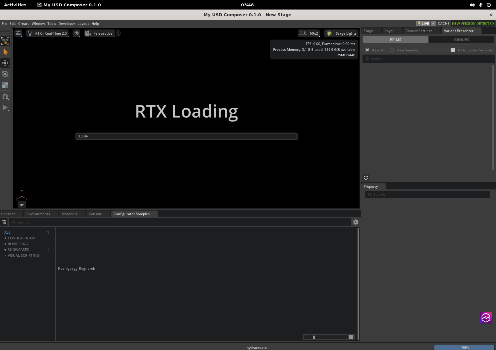
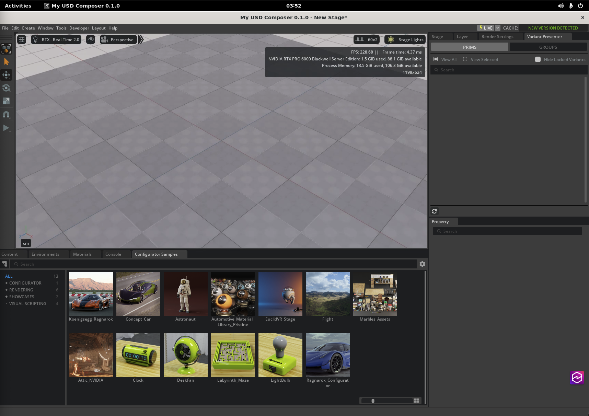
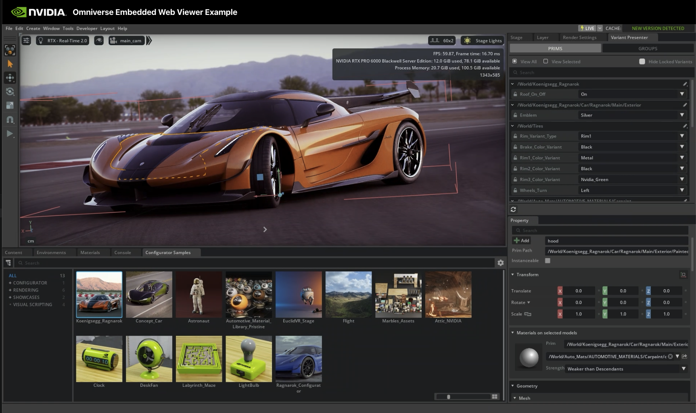

# NVIDIA Omniverse on AWS — 디지털 트윈 구축 가이드

산업 설비 디지털 트윈 구축을 위한 NVIDIA Omniverse(Kit/RTX) + NIM
배포용 AWS CDK 프로젝트입니다. (Nucleus는 미사용 — 로컬 USD 파일/볼륨 사용)

관련 문서:
- [`CLAUDE.md`](./CLAUDE.md) — 상세 설계·요구사항·결정사항
- [`SPEC.md`](./SPEC.md) — 사양서 (아키텍처 다이어그램, 인스턴스/SW 스택, 비용)
- [`docs/TROUBLESHOOTING.md`](./docs/TROUBLESHOOTING.md) — 실배포에서 겪은 문제·해결 모음

---

## ⚠️ 가장 중요한 유의사항 — 외부 트래픽을 차단하지 마세요

랜딩존 / 사내 폐쇄망에서 외부 아웃바운드를 막으면 Omniverse Kit, CAD Converter,
NIM이 설치·동작하지 않습니다.

필요 패키지/익스텐션/이미지를 외부에서 받기 위해 아래 도메인의 아웃바운드(443)를
반드시 허용해야 합니다 (랜딩존 SCP / 방화벽 / 프록시 화이트리스트):

| 도메인 | 용도 |
|--------|------|
| `pypi.nvidia.com` | Kit / 익스텐션(CAD Converter 등) 패키지 |
| `*.nvidia.com` (Kit 레지스트리) | Kit 익스텐션 레지스트리 |
| `nvcr.io` + NGC CDN | NIM / 컨테이너 이미지 |
| Ubuntu / Docker apt 미러 | OS 패키지 |

폐쇄망이 불가피하면 사전 미러링(사내 ECR + PyPI 미러 + 오프라인 익스텐션 번들)이
필요합니다.

---

## 인프라 구성도

### private 모드 (운영 — 사내 전용)



### public 모드 (랜딩존 밖 단독 테스트)



> 보안: `0.0.0.0/0`은 두 모드 모두 합성 단계에서 차단됩니다.
> public 모드는 테스트 후 스택 삭제 또는 private 재배포를 권장합니다.

---

## 배포 절차 (Quick Start)

```bash
# 0) 사전: AWS 자격증명 설정
#  [일반 사용자] 아래 중 하나로 인증 (환경에 맞게 택1)
export AWS_PROFILE=<your-profile>            # aws configure로 미리 설정한 프로파일
#   또는 SSO:  aws sso login --profile <your-profile>
#   또는 키:   aws configure  (Access Key/Secret 입력)
aws sts get-caller-identity                  # 어느 계정/리전인지 반드시 확인
#  [Amazon 내부 직원만] Midway 인증
#   mwinit -o && export AWS_PROFILE=claude-code && aws sts get-caller-identity

# 0-1) (NIM 사용 시) NGC API Key를 Secrets Manager에 미리 생성 → ARN 확보
./scripts/create-ngc-secret.sh -p <your-profile>   # 프롬프트로 키 숨김 입력
#   → 출력된 ARN을 5)의 -c ngcSecretArn= 에 사용

# 1) 의존성 설치
npm install

# 2) 타입 체크 (선택)
npx tsc --noEmit

# 3) 최초 1회 부트스트랩 (계정/리전당 1회)
npx cdk bootstrap aws://<account>/ap-northeast-2

# 4) 합성 — 배포 전 템플릿/가드레일 확인 (실제 리소스 생성 안 함)
npx cdk synth -c deploymentMode=public -c createVpc=true -c allowedCidr=<내공인IP>/32

# 5) 배포 (subnetIds·availabilityZones는 같은 순서로 짝)
#    NIM 사용 시 0-1)에서 받은 ARN을 -c ngcSecretArn= 으로 넘기면 부팅 중 pull 성공
npx cdk deploy -c deploymentMode=private -c vpcId=vpc-xxxx \
  -c subnetIds=subnet-2a,subnet-2b \
  -c availabilityZones=ap-northeast-2a,ap-northeast-2b \
  -c allowedCidr=10.1.0.0/16 \
  -c installNim=true -c ngcSecretArn=<0-1에서 받은 ARN>
```

> 합성(synth)만으로 입력 검증(허용 인스턴스 4종, `0.0.0.0/0` 금지, 모드별 필수값)과
> cdk-nag 보안 점검이 돌아갑니다. 배포 전 `synth`로 먼저 확인하세요.

배포 후:
- 출력(Outputs)의 `PrivateIp`(private) 또는 `PublicIp`(public)로 DCV(`https://<IP>:8443`)·SSH 접속.
- DCV 비밀번호: `DcvSecretArn` 시크릿을 콘솔/CLI로 조회 (자동 생성됨).
- ⚠️ `NgcSecretArn` 시크릿은 플레이스홀더로 생성됨 → 실제 NGC API Key로 교체해야 NIM pull 동작:
  ```bash
  aws secretsmanager put-secret-value --secret-id <NgcSecretArn> --secret-string 'nvapi-...'
  ```

### DCV TLS 인증서

DCV는 8443 HTTPS이며, 기본은 DCV가 자동 생성하는 self-signed 인증서를 사용합니다.
- 검증/데모 단계: self-signed로 충분 (접속자는 `allowedCidr` + DCV 비밀번호로 제한).
  단, 브라우저가 인증서 경고를 띄우므로 "계속 진행"으로 넘겨야 합니다(정상).
- 사내 정책상 신뢰 인증서가 필요하면: 사내 CA 발급 인증서를 Secrets Manager에
  `{"cert":"<PEM>","key":"<PEM>"}` 형식으로 저장 → `-c dcvCertSecretArn=<ARN>`.
  부팅 시 `/etc/dcv/`에 배치하고 dcvserver를 재시작합니다.

```bash
# 사내 CA 인증서 시크릿 예시
aws secretsmanager create-secret --name dcv-cert \
  --secret-string "$(jq -n --arg c "$(cat dcv.pem)" --arg k "$(cat dcv.key)" '{cert:$c,key:$k}')"
cdk deploy ... -c dcvCertSecretArn=arn:aws:secretsmanager:ap-northeast-2:<acct>:secret:dcv-cert-XXXX
```

---

## 주요 파라미터 (cdk context, `-c key=value`)

| 파라미터 | 기본값 | 설명 |
|----------|--------|------|
| `stackName` | `OmniverseNimStack` | 스택 이름. 같은 VPC에 2호기 이상 독립 배포 시 다르게 지정 (아래 참고) |
| `deploymentMode` | `private` | `private`(사내전용) / `public`(테스트) |
| `instanceType` | `g7e.4xlarge` | g7e.4xlarge / g7e.12xlarge / g6e.4xlarge / g6e.12xlarge (그 외 합성 차단) |
| `allowedCidr` | (필수) | 접속 허용 대역. private=사내망, public=내 IP/32. 콤마로 다중 입력. `0.0.0.0/0` 금지 |
| `vpcId` | (기존 VPC 필수) | 미리 생성된 기존 VPC ID (VPN/DX 연결) |
| `subnetIds` | (기존 VPC 필수) | 배치 후보 서브넷들. 콤마 다중 입력 (2a,2b 등) |
| `availabilityZones` | (필수, subnetIds와 짝) | subnetIds와 같은 순서의 AZ 목록 (예: ap-northeast-2a,ap-northeast-2b) |
| `subnetIndex` | `0` | 이번 배포에 쓸 서브넷 인덱스. capacity 막히면 인덱스만 바꿔 재배포(AZ 폴백) |
| `createVpc` | `false` | public 테스트용 신규 VPC 생성 (vpcId/subnetIds 대신) |
| `keyPairName` | - | 기존 EC2 키페어 이름 (SSH용, 미지정 시 SSM만) |
| `installNim` | `false` | NIM 컨테이너 설치(Docker+toolkit+pull) 여부 |
| `nimImage` | `domino-automotive-aero:2.1.0-41313772` | pull할 NIM 이미지 (installNim 시). ⚠️ NGC에 `:latest` 태그 없음 → 실제 태그 명시 |
| `nimPort` | `8000` | NIM 추론 API 포트 (SG 인바운드 추가) |
| `rootVolumeSizeGb` | `500` | 루트 gp3 용량 (OS+캐시 통합) |
| `assetBucketName` | - | 모델/에셋 전송용 S3 버킷 (IAM 권한 부여) |
| `installCodeServer` | `false` | (옵션) code-server 설치. 기본 미설치 |
| `dcvCertSecretArn` | - | (옵션) 사내 CA DCV TLS 인증서 시크릿 ARN. 미지정 시 self-signed |
| `retainDataOnDelete` | `false` | 스택 삭제 시 루트 볼륨 보존 여부 |
| `ownerTag` | - | `Owner` 태그 값 (비용 추적) |

예시:

```bash
# 운영(사내, private) — NIM 포함, 2a/2b 서브넷 등록 후 2a에 배치(index 0)
cdk deploy -c deploymentMode=private -c vpcId=vpc-xxxx \
  -c subnetIds=subnet-2a,subnet-2b \
  -c availabilityZones=ap-northeast-2a,ap-northeast-2b \
  -c allowedCidr=10.1.0.0/16 -c installNim=true

# 2a가 capacity 부족이면 인덱스만 바꿔 2b로 재배포 (AZ 폴백)
cdk deploy ... -c subnetIndex=1

# 랜딩존 밖 테스트 (public, 신규 VPC, 기본 g7e.4xlarge)
cdk deploy -c deploymentMode=public -c createVpc=true \
  -c allowedCidr=<내공인IP>/32
```

### 같은 VPC에 2호기 이상 배포 (충돌 주의)

기존 VPC 모드(private/public)는 IGW·NAT를 만들지 않고 참조만 하므로, 같은 VPC에
EC2를 여러 대 두어도 네트워크 충돌은 없다 (SG·IAM·Secret·LogGroup은 스택마다 자동
이름 → 겹치지 않음). 단 **스택 이름을 반드시 다르게** 줘야 한다.

```bash
# 1호기 (기본 이름 OmniverseNimStack)
cdk deploy -c vpcId=vpc-xxxx -c subnetIds=subnet-2a,subnet-2b \
  -c availabilityZones=ap-northeast-2a,ap-northeast-2b -c allowedCidr=10.1.0.0/16

# 2호기 — stackName을 다르게 (같은 VPC, 독립 인스턴스)
cdk deploy -c stackName=OmniverseNimStack2 \
  -c vpcId=vpc-xxxx -c subnetIds=subnet-2a,subnet-2b \
  -c availabilityZones=ap-northeast-2a,ap-northeast-2b -c allowedCidr=10.1.0.0/16
```

> ⚠️ `stackName`을 바꾸지 않고 재배포하면 새 인스턴스가 아니라 **기존 스택 업데이트
> = 기존 EC2 교체(replace)**가 된다. 2호기는 반드시 다른 `stackName`으로.
> 확인 필요: G/VT vCPU 쿼터(2대 합산), 같은 AZ의 g7e capacity(폴백은 `subnetIndex`),
> public 다수 시 EIP 쿼터. NGC 시크릿 ARN은 여러 스택이 공유해도 무방.
> `createVpc=true`는 매번 새 VPC(+NAT 1개)를 만든다 → 2번 쓰면 NAT 비용 2배·CIDR
> (`10.20.0.0/16`) 중복. 2호기를 같은 VPC에 둘 땐 `createVpc` 없이 `vpcId`로 참조.

---

## 프로젝트 구조

```
nvidia-omniverse-cdk/
├── bin/app.ts                  # CDK 앱 엔트리 (파라미터 파싱 + cdk-nag + 스택)
├── lib/
│   ├── config.ts               # 파라미터 검증 (허용 4종 / 0.0.0.0/0 차단 / 모드별 필수값)
│   ├── omniverse-nim-stack.ts  # 메인 스택 (VPC/SG/IAM/Secrets/EC2/EIP)
│   └── user-data.ts            # 부트스트랩 (드라이버→Kit라이브러리→DCV→Docker/NIM)
├── scripts/
│   ├── create-ngc-secret.sh        # NGC API Key를 Secrets Manager에 생성 → ARN 출력
│   ├── install-omniverse-host.sh   # (옵션) 호스트 패키지 전체 수동 설치 — UserData 폴백
│   └── install-nim.sh              # (옵션) NIM 컨테이너만 설치/실행/헬스체크 (모델 교체용)
├── cdk.json                    # context 기본값 (배포 시 -c 로 덮어씀)
├── package.json / tsconfig.json
├── CLAUDE.md                   # 상세 설계/요구사항
└── SPEC.md                     # 사양서 (아키텍처 다이어그램 포함)
```

생성되는 주요 리소스: EC2(GPU) + Security Group + IAM Role + Secrets(DCV/NGC) +
CloudWatch Log Group + (public)EIP / (createVpc)VPC·NAT·Flow Log.
부팅 후 부트스트랩 진행/결과는 `/var/log/omniverse-bootstrap.log`와 CloudWatch
로그 그룹에서 확인합니다(완료 시 `/var/log/omniverse-bootstrap.done` 생성).

---

## 스크립트 (`scripts/`)

세 개의 헬퍼 스크립트를 제공한다. 용도가 다르니 아래 표로 먼저 구분한다.

| 스크립트 | 실행 위치 | 권한 | 언제 쓰나 |
|----------|-----------|------|-----------|
| `create-ngc-secret.sh` | 배포 머신(로컬) | AWS 자격증명 | 배포 전 NGC 키를 Secrets Manager에 넣고 ARN 확보 |
| `install-omniverse-host.sh` | EC2 안 | `sudo` | UserData가 실패했거나 CDK 없이 띄운 EC2에 전체 스택 수동 설치 |
| `install-nim.sh` | EC2 안 | `sudo` | NIM만 설치/교체/재시작 (Kit·DCV는 그대로) |

> ⚠️ `install-*` 두 스크립트는 EC2 인스턴스 내부에서 root로 실행한다(배포 머신 아님).
> 정상 배포라면 UserData가 자동 설치하므로 둘 다 선택(옵션)이다 — 폴백·재설치·교체용.
> 둘 다 멱등(여러 번 실행해도 안전)하게 작성됐다.

### `create-ngc-secret.sh` — NGC 키를 Secrets Manager에 등록 (배포 머신)

NIM pull에 필요한 NGC API Key를 시크릿으로 만들고 ARN을 출력한다. 그 ARN을
`cdk deploy -c ngcSecretArn=<ARN>`으로 넘기면 부팅 중 NIM pull이 즉시 성공한다.

```bash
./scripts/create-ngc-secret.sh -p <your-profile>     # 프롬프트로 키 숨김 입력(권장)
./scripts/create-ngc-secret.sh -n my-ngc -r ap-northeast-2 nvapi-xxxx   # 이름/리전/키 직접
```

| 옵션 | 기본값 | 설명 |
|------|--------|------|
| `[KEY]` (위치 인자) | (프롬프트) | NGC API Key. 생략 시 숨김 프롬프트(히스토리에 안 남음, 권장) |
| `-n NAME` | `omniverse-ngc-api-key` | 시크릿 이름 |
| `-r REGION` | `ap-northeast-2` | 리전 |
| `-p PROFILE` | (환경 그대로) | AWS 프로파일 |

- 이미 같은 이름의 시크릿이 있으면 값만 갱신(put), 없으면 생성(create).
- 출력된 ARN을 그대로 `-c ngcSecretArn=`에 사용.

### `install-omniverse-host.sh` — 호스트 패키지 전체 수동 설치 (EC2, 폴백)

UserData와 동일한 계층(드라이버 검증 → Kit 런타임 라이브러리 → Vulkan/GL 검증 →
Docker+Container Toolkit+NIM → DCV+Xorg → Python 3.12)을 멱등하게 설치한다.
부트스트랩이 일부 실패했거나(`/var/log/omniverse-bootstrap.done` 미생성), CDK 없이
EC2를 수동 기동한 경우의 폴백.

```bash
# EC2 안에서 root로
sudo ./scripts/install-omniverse-host.sh                  # 드라이버 검증 + Kit 라이브러리 + DCV (기본)
sudo ./scripts/install-omniverse-host.sh --with-nim       # + Docker/Toolkit + NIM (NGC 키 프롬프트)
sudo ./scripts/install-omniverse-host.sh --with-python312 # + Python 3.12 (CAD 변환/USD 스크립팅)

# CDK가 만든 시크릿 재사용 (키·비번을 프롬프트 없이 주입)
sudo ./scripts/install-omniverse-host.sh --with-nim \
  --ngc-secret <NgcSecretArn> --dcv-secret <DcvSecretArn>

# 특정 단계만 재시도 (예: DCV만 다시 — Kit 라이브러리는 건너뜀)
sudo ./scripts/install-omniverse-host.sh --skip-kit-libs
```

| 옵션 | 기본값 | 설명 |
|------|--------|------|
| `--with-nim` | off | Docker + Container Toolkit 설치 + NIM pull/run |
| `--nim-image IMG` | `domino-automotive-aero:2.1.0-41313772` | NIM 이미지 (`--with-nim` 시) |
| `--nim-port PORT` | `8000` | NIM 노출 포트 |
| `--ngc-key KEY` | (프롬프트) | NGC API Key 직접 입력 |
| `--ngc-secret ARN` | - | NGC 키를 Secrets Manager에서 조회 (`--ngc-key` 대신) |
| `--dcv-password PW` | (프롬프트) | DCV(ubuntu) 비밀번호 직접 입력 |
| `--dcv-secret ARN` | - | DCV 비번을 Secrets Manager에서 조회 |
| `--with-python312` | off | Python 3.12(deadsnakes) 설치 |
| `--region REGION` | `ap-northeast-2` | 시크릿 조회 리전 |
| `--skip-dcv` | off | DCV 단계 건너뛰기 |
| `--skip-kit-libs` | off | Kit 런타임 라이브러리 단계 건너뛰기 |
| `-h, --help` | - | 전체 도움말 |

- 단계 구성: ① 드라이버 검증 → ④ Kit 라이브러리 → Vulkan/GL 검증 →
  ② Docker/Toolkit(+NIM, `--with-nim`) → ⑤ DCV+Xorg(+비번) → ⑥ Python 3.12(`--with-python312`).
- 끝에 진단 체크리스트(nvidia-smi / vulkan ICD / docker / dcvserver / python3.12 / NIM)를
  출력하고, 로그는 `/var/log/omniverse-install.log`에 남는다(완료 시 `*.done`).
- NGC 키·DCV 비번은 직접 입력(`--ngc-key`/`--dcv-password`), 시크릿 조회(`--ngc-secret`/
  `--dcv-secret`), 프롬프트(숨김) 중 택1. 시크릿 조회는 EC2 IAM Role에 읽기 권한 필요.
- ⚠️ kit-app-template 빌드는 대화형이라 포함되지 않는다 → DCV 접속 후 수동(아래 "2) Kit 앱 설치").

### `install-nim.sh` — NIM 컨테이너 전용 (EC2, 모델 교체·재시작)

NIM 한 가지만 다룬다: Docker/Toolkit 설치(필요 시) → nvcr.io 로그인 → pull → run →
헬스체크(`/v1/health/ready`가 READY 될 때까지 최대 ~10분 폴링). 모델만 바꾸거나 NIM
컨테이너만 다시 띄울 때 host 스크립트 전체를 돌릴 필요 없이 이걸 쓴다.

```bash
sudo ./scripts/install-nim.sh                              # 기본 모델 pull+run+헬스체크
sudo ./scripts/install-nim.sh --ngc-secret <NgcSecretArn>  # NGC 키를 시크릿에서 조회
sudo ./scripts/install-nim.sh --nim-image  --nim-port 8001   # 다른 NIM 모델로 교체
sudo ./scripts/install-nim.sh --gpu-device 1               # 멀티 GPU: GPU 1에만 배치
sudo ./scripts/install-nim.sh --skip-docker --no-run       # pull만 (Docker 이미 있음)
```

| 옵션 | 기본값 | 설명 |
|------|--------|------|
| `--nim-image IMG` | `domino-automotive-aero:2.1.0-41313772` | NIM 이미지 |
| `--nim-port PORT` | `8000` | 노출 포트 |
| `--ngc-key KEY` | (프롬프트) | NGC API Key 직접 입력 |
| `--ngc-secret ARN` | - | NGC 키를 Secrets Manager에서 조회 |
| `--region REGION` | `ap-northeast-2` | 시크릿 조회 리전 |
| `--gpu-device N` | `all` | 특정 GPU에만 배치 (멀티 GPU 분리, 예: `1`) |
| `--cache-dir DIR` | `/opt/nim/cache` | 모델 캐시 호스트 경로 |
| `--name NAME` | `nim` | 컨테이너 이름 |
| `--no-run` | off | pull까지만, 컨테이너 실행 안 함 |
| `--skip-docker` | off | Docker/Toolkit 설치 건너뛰기 (이미 있을 때) |
| `-h, --help` | - | 전체 도움말 |

- 멱등성: 기존 동명 컨테이너를 `docker rm -f` 후 재실행 → 모델 교체/재시작에 안전.
- 헬스체크 중 컨테이너가 죽으면 `docker logs` 일부를 출력하고 중단(원인 파악 용이).
- 끝에 요약(이미지/컨테이너 상태/엔드포인트/로그 명령) 출력. 로그: `/var/log/nim-install.log`.
- `--gpu-device`는 g7e.12xlarge/g6e.12xlarge 등 멀티 GPU에서 NIM을 특정 GPU에 고정할 때
  (Kit과 GPU 분리 — CLAUDE.md 섹션 5-3). 단일 GPU는 기본 `all`로 충분.

---

## 배포 후 검증 & Omniverse Kit 설치

DCV로 접속(`https://<IP>:8443`, ubuntu / DCV 시크릿 비번)한 뒤, 상단 **Terminal**을
열어 아래를 확인/실행한다. (부트스트랩은 드라이버·DCV·Kit 런타임 라이브러리·NIM까지
자동 설치하고, **Omniverse Kit 앱만 수동 설치** — 대화형이라 자동화 불가.)

### 0) (옵션) 부트스트랩 폴백 — 수동 설치 스크립트

정상 배포라면 UserData가 패키지를 자동 설치하므로 이 단계는 건너뛴다. 부트스트랩이
일부 실패했거나(`/var/log/omniverse-bootstrap.done` 미생성) CDK 없이 EC2를 수동
기동한 경우, EC2 안에서 아래 폴백 스크립트로 재설치한다 (옵션·전체 사용법은 위
"[스크립트 (`scripts/`)](#스크립트-scripts)" 섹션 참고).

```bash
# 전체 스택 수동 설치 (드라이버·Kit 라이브러리·DCV, 필요 시 + NIM/Python)
sudo ./scripts/install-omniverse-host.sh --with-nim --ngc-secret <NgcSecretArn> --dcv-secret <DcvSecretArn>

# NIM만 설치/교체/재시작
sudo ./scripts/install-nim.sh --ngc-secret <NgcSecretArn>
```

> kit-app-template 빌드는 대화형이라 어느 스크립트에도 포함되지 않는다 → 아래 2)에서 수동 진행.

### 1) 설치 구성요소 확인 (이미 떠 있음)

```bash
# GPU 드라이버
nvidia-smi                                   # GPU 이름/드라이버/VRAM/프로세스

# NIM 컨테이너 (installNim=true 시)
docker ps                                    # nim 컨테이너 Up 확인
curl -k http://localhost:8000/v1/health/ready   # 추론 API → 200이면 정상
docker logs nim | tail -30                   # NIM 로그 (model READY 확인)

# Kit 런타임 라이브러리 (3D 렌더 가능 여부)
vulkaninfo --summary                         # NVIDIA Vulkan ICD 로드 확인
glxinfo | grep "OpenGL renderer"             # GL 렌더러

# DCV
dcv list-sessions                            # poc-session 보임
dcv version
```

### 2) Omniverse Kit 앱 설치 (DCV 터미널에서 대화형)

> ⚠️ `repo.sh template new`는 대화형 메뉴(앱 종류·이름 선택)가 필수 →
> SSM/스크립트 자동화 불가. 반드시 DCV GUI 터미널에서 직접 실행한다.

```bash
cd ~
git clone https://github.com/NVIDIA-Omniverse/kit-app-template.git
cd kit-app-template

# (최초 1회) packman이 Python 3.12를 자동 다운로드 → 수십 초 소요
./repo.sh template new
#   → 화살표/엔터로 메뉴 선택:
#     - "Application" 선택
#     - "Kit Base Editor" 또는 "USD Composer" 등 원하는 앱 템플릿 선택
#     - 앱 이름/표시이름 입력 (기본값 엔터 가능)

./repo.sh build           # 익스텐션·의존성 자동 다운로드 + 빌드 (수 분~십수 분)
./repo.sh launch          # 앱 실행 → DCV 화면에 3D 뷰포트 GUI가 뜬다
#   → 실행할 .kit 파일을 물으면 방금 만든 앱 선택
```

- 빌드 중 다운로드가 일어나므로 외부 도메인 허용 필수(섹션 상단 유의사항).
- `launch` 후 USD Composer 등에서 USD 씬을 열어 RTX 렌더링되면 "트윈 본체" 검증 완료.
- CAD 변환(NX→USD)은 Kit 앱 내 CAD Converter 익스텐션 또는 headless CLI 사용
  (상세: `CLAUDE.md` 섹션 5-4).

### 검증 완료 화면 (실배포 확인됨)

DCV 화면에서 USD Composer가 실행되어 RTX 렌더러가 구동되는 모습 —
Omniverse Kit + RTX가 AWS GPU(g7e.4xlarge, RTX PRO 6000)에서 동작함을 입증.

최초 실행 — "RTX Loading"(셰이더 컴파일, 수 분 소요. CPU로 컴파일하므로 GPU 크기와 무관):



컴파일 완료 후 — RTX 실시간 렌더 뷰포트 + 에셋 라이브러리 로드 (정상 구동):



> 정상 판정 지표 (우측 상단 HUD):
> - `FPS 228 / Frame 4.37ms` → RTX Real-Time 렌더러가 실시간 렌더링 중 (GPU 가속 정상)
> - `RTX PRO 6000 Blackwell: 1.5 GiB used, 88.1 GiB available` → GPU 인식 + VRAM 여유
> - `RTX - Real-Time 2.0` 렌더 모드, 3D 그리드 뷰포트 또렷하게 표시
>
> ⚠️ "RTX Loading 0%"에서 멈춘 듯 보여도 첫 셰이더 컴파일 중일 뿐(인스턴스 크기 무관).
> `nvidia-smi`로 kit이 GPU 사용 중 + `top`에서 kit CPU 높으면 진행 중 → 수 분 대기.
> 한 번 캐시(`~/.cache/ov`)되면 다음 실행은 수십 초로 단축.

### 3) NIM 추론 API 연동 검증 (CFD NIM)

NIM이 "단순히 떠 있는" 게 아니라 실제 추론하는지 확인. DoMINO-Automotive-Aero는
형상(STL) + 유속을 받아 표면 압력장/항력 등을 반환한다.

```bash
# 추론 엔드포인트 확인 (OpenAPI)
curl -k http://localhost:8000/openapi.json | python3 -c "import sys,json;print('\n'.join(json.load(sys.stdin)['paths']))"
#   → /v1/infer/surface, /v1/infer/volume, /v1/model/config, /v1/metadata ...

# 모델 메타데이터 (어떤 모델인지)
curl -k http://localhost:8000/v1/metadata
#   → modelInfo: domino-drivsim:1.4.0

# 실제 추론 (STL 형상 + 유속 + point_cloud_size) → 결과는 npy ZIP
curl -k -X POST http://localhost:8000/v1/infer/surface \
  -F design_stl=@형상.stl -F stream_velocity=30.0 -F point_cloud_size=1000 \
  -o result.zip -w 'HTTP:%{http_code} time:%{time_total}s\n'
```

실배포 검증 결과 (2026-05-30): `HTTP 200, 2.9초`로 아래 물리량을 반환 —
`pressure_surface.npy`(표면 압력장), `wall_shear_stress.npy`(벽면 전단응력),
`drag_force.npy`(항력), `lift_force.npy`(양력), `surface_coordinates.npy`.
→ SPEC 다이어그램의 "Kit-CAE → NIM 추론 요청/응답" 연결 실증. 전통 CFD 수 시간 → AI 2.9초.

### 4) S3 → EC2 데이터 전송 (IAM Role)

```bash
# assetBucketName 지정 배포 시 — IAM Role로 키 없이 접근
aws s3 ls s3://<버킷>/                          # ListBucket
aws s3 cp s3://<버킷>/sample.usd /opt/nim/cache/  # GetObject
```

### 아키텍처 연결 검증 매트릭스 (SPEC 다이어그램 기준)

| 연결 | 검증 | 방법 |
|------|:----:|------|
| 브라우저 → DCV(8443) | ✅ | 브라우저 접속 + 데스크톱 |
| Kit·NIM → GPU 드라이버 | ✅ | `nvidia-smi` 둘 다 GPU 사용 |
| Kit(USD Composer) → RTX 렌더 | ✅ | 3D 뷰포트 228fps |
| Kit-CAE → NIM 추론 요청/응답 | ✅ | `/v1/infer/surface` HTTP 200 (압력장 반환) |
| S3 → EC2 (USD/CAD 로드) | ✅ | IAM Role + `aws s3 cp` |
| 브라우저 → Kit (WebRTC 스트리밍) | ✅ | Kit livestream + web-viewer-sample (아래 5절) |
| 브라우저 → Kit 양방향 입력 (Variant 조작) | ✅ | 브라우저에서 색상/옵션 변경 → 실시간 반영 |

> ✅ 실증 확인(2026-05-30): 브라우저 WebRTC 루프를 **Blueprint 없이 순수 Kit으로** 완성.
> Blueprint `compose up --build`는 외부 AWS에서 `urm.nvidia.com`(NVIDIA 사내
> Artifactory) 의존으로 실패하지만, Kit 자체 streaming(`omni.kit.livestream.webrtc`)은
> 외부 의존이 없어 우리 환경에서 구동됨. → 아래 5절 절차 참고.
>
> 참고 — Blueprint 전체 스택(자동차 CFD UI + NIM 실시간 추론 루프)은 별개:
> standard 프로파일은 GPU 2개 필요(g7e.12xlarge/g6e.12xlarge), g7e.4xlarge는 GPU 1개라
> lite만 가능. 또한 from-source 빌드가 사내 Artifactory 의존 → build.nvidia.com 또는
> 리포의 `deploy/aws-cdk`(prebuilt 이미지) 경로 필요. (상세: `CLAUDE.md` 섹션 0-1)

### 5) 브라우저 WebRTC 스트리밍 (Blueprint 없이 Kit 단독) — 실증 완료

USD Composer(또는 임의 Kit 앱)를 브라우저로 실시간 스트리밍하고 마우스/키보드로
조작하는 완전한 루프. Blueprint의 전용 스택 없이 Kit 표준 streaming만으로 구현.

```bash
# (전제) kit-app-template에서 base 앱(예: my_usd_composer)이 이미 build 되어 있음

# (1) streaming 설정 .kit 생성 — base 앱 + livestream 익스텐션
#     source/apps/<app>_streaming.kit 에 아래 핵심만:
#     [dependencies] "<base_app>" = {} / "omni.kit.livestream.app" = {}
#     template_name = "omni.streaming_configuration"

# (2) Kit을 livestream 모드로 실행 (headless, 공인 IP를 ICE 후보로)
cd ~/kit-app-template/_build/linux-x86_64/release
./<base_app>.kit.sh --enable omni.kit.livestream.app --no-window \
  --/app/livestream/publicEndpointAddress=<EIP> --/app/livestream/port=49100
#   → omni.kit.livestream.webrtc 로드 + 49100(signaling) LISTEN 확인

# (3) 브라우저 web client (web-viewer-sample)
git clone https://github.com/NVIDIA-Omniverse/web-viewer-sample.git
cd web-viewer-sample
# stream.config.json: source="local", local.server=<EIP>, signalingPort=49100
npm install
npm run dev -- --host 0.0.0.0 --port 5173   # 외부 접속 허용
```

브라우저에서 `http://<EIP>:5173` 접속 →
1. "UI for **any** streaming app" 선택 → Next (USD Composer 등 임의 앱은 이걸 선택)
2. Kit의 3D 뷰포트가 브라우저로 스트리밍됨 (마우스/키보드 양방향)
3. Configurator Samples에서 자동차 등 USD 로드 → 우측 Variant Presenter에서
   색상/옵션 변경 → 브라우저에서 실시간 반영

필요 포트(SG): 49100/tcp(signaling), 1024/udp·47995-48012·49000-49007(미디어),
5173/tcp(web client). 클라우드는 `publicEndpointAddress`에 EIP 지정 필수(ICE 후보).

| 단계 | 실증 결과 (2026-05-30) |
|------|------|
| streaming kit + `./repo.sh build` | ✅ (urm.nvidia.com 의존 없음 — Blueprint와 달리 외부 빌드됨) |
| livestream.webrtc 로드 + 49100 LISTEN | ✅ |
| web-viewer-sample → 브라우저 스트리밍 | ✅ USD Composer 3D 뷰포트 표시 |
| USD 자동차 로드 + RTX 렌더 (브라우저) | ✅ 60fps, 머티리얼·환경 완전 렌더 |
| 브라우저에서 Variant 변경 (양방향) | ✅ Emblem/Rim 색상 실시간 반영 |



> ⚠️ "흰 화면 → 재연결 시 완성 렌더": 머티리얼/환경 텍스처를 S3에서 로딩하는 동안
> WebRTC 세션이 끊길 수 있음 → 브라우저 새로고침/재연결하면 완성 렌더가 나온다(정상).

---

## 배포 대상

- 리전: ap-northeast-2 (서울)
- OS: Ubuntu 22.04 (DL Base OSS Nvidia Driver GPU AMI)
- GPU: L40S(g6e) 또는 RTX PRO 6000(g7e)
- 접속: Amazon DCV(구 NICE DCV, 원격 데스크톱) + SSH/SSM

## NIM ↔ Omniverse 연동 (AI-Powered CAE)

학습된 AI 물리 모델을 NIM이 API로 서빙하고, Omniverse Kit-CAE가 그 추론 결과를
실시간 3D로 시각화합니다.

```
[전처리]           [학습]              [추론/배포]         [시각화]
PhysicsNeMo  →  PhysicsNeMo Train  →  NIM(추론 API)  →  Omniverse Kit-CAE
 Curator          (CFD surrogate)      localhost:8000     (3D 실시간 렌더)
```

실시간 루프: Kit-CAE에서 형상 변경 → NIM 추론(수 초) → 압력장/유속 3D 렌더.
핵심 가치: 전통 CFD 수 시간 → AI surrogate 수 초. 상세는 `CLAUDE.md` 섹션 0-3.

> 본 구성(Phase 1)은 pre-trained NIM을 NGC에서 pull → 시각화까지만 검증합니다.
> PhysicsNeMo(전처리·학습)는 대상 도메인 커스텀 모델이 필요한 Phase 2 과제입니다.

## NGC API Key 발급 (NIM pull용)

NIM 컨테이너를 받으려면 NGC API Key가 필요합니다. 본인 NGC 계정으로 직접 발급하며
공유할 수 없습니다 (발급 후 Secrets Manager로 관리 → 부팅 시 주입).

1. https://ngc.nvidia.com 접속 → "Sign Up"(회사 이메일 권장) → 이메일 인증
2. 로그인 → 우측 상단 프로필 → "Setup" → "Generate API Key" → "Generate Personal Key"
3. 키 복사 (한 번만 표시되므로 반드시 저장). 키는 `nvapi-` 로 시작
4. 확인: `docker login nvcr.io` (Username: `$oauthtoken`, Password: 발급 키)

발급한 키를 Secrets Manager에 미리 넣어 ARN을 받는 헬퍼 스크립트 제공:

```bash
# 프롬프트로 키 숨김 입력(권장) → 시크릿 생성/갱신 후 ARN 출력
./scripts/create-ngc-secret.sh -p <your-profile>
#   옵션: -n <시크릿이름>(기본 omniverse-ngc-api-key)  -r <리전>(기본 ap-northeast-2)
#   출력된 ARN을 배포에 사용:  cdk deploy ... -c installNim=true -c ngcSecretArn=<ARN>
```

> 무료 계정으로 NIM pull 가능 (NVAIE 불필요). 상세는 `CLAUDE.md` 섹션 9-1.
> ⚠️ 키를 명령 인자로 직접 넘기면 셸 히스토리에 남으니 프롬프트 입력을 권장.

## CAD → USD (디지털 트윈)

- 고객 CAD: 지멘스 NX(.prt). Omniverse CAD Converter가 네이티브 지원(추가 라이선스 없음).
- 권장 경로: NX → JT → USD (지멘스 공식). 전 과정 Ubuntu에서 동작.
- 상세: `CLAUDE.md` 섹션 5-4.

## 사전 준비물

### 배포 머신에 미리 설치 (CDK 배포 실행 환경)

배포를 실행하는 로컬 PC 또는 배포 서버에 아래 도구가 사전 설치되어 있어야 합니다.

| 도구 | 버전 | 용도 | 링크 |
|------|------|------|------|
| AWS CLI | v2 | AWS 인증/조회 | https://docs.aws.amazon.com/cli/latest/userguide/getting-started-install.html |
| Node.js | >=18 LTS | CDK(TypeScript) 런타임 | https://nodejs.org |
| AWS CDK | v2 (2.1118+) | 인프라 배포 | https://docs.aws.amazon.com/cdk/v2/guide/getting_started.html |
| (옵션) Docker | 최신 | CDK 에셋 번들링 시에만 | https://www.docker.com/products/docker-desktop/ |

```bash
# 설치 확인
aws --version          # aws-cli/2.x
node --version         # v18+ (또는 v20 LTS)
cdk --version          # 2.1118.0 이상
npm install            # 프로젝트 의존성 설치
```

- 언어는 TypeScript이므로 Node.js/npm이 필수, Python은 불필요.
- Docker는 본 스택이 컨테이너 이미지를 로컬 빌드하지 않으므로 기본 불필요(옵션).
- 인증(일반 사용자): `aws configure` 또는 `aws sso login --profile <p>` → `export AWS_PROFILE=<p>`
  → `aws sts get-caller-identity`로 계정/리전 확인. (Amazon 내부 직원은 `mwinit -o` 사용)
- 최초 1회 `cdk bootstrap aws://<account>/ap-northeast-2` 필요.

### AWS 계정 / 권한 준비

- AWS 계정 + 자격증명, CDK bootstrap 완료
- NGC API Key (테스트는 무료 키로 충분)
- G/VT 온디맨드 vCPU 쿼터 (`L-DB2E81BA`) — 4종 각 2개 동시 시 256 vCPU
- 위 외부 도메인 아웃바운드 허용 (랜딩존 SCP/방화벽 화이트리스트)
