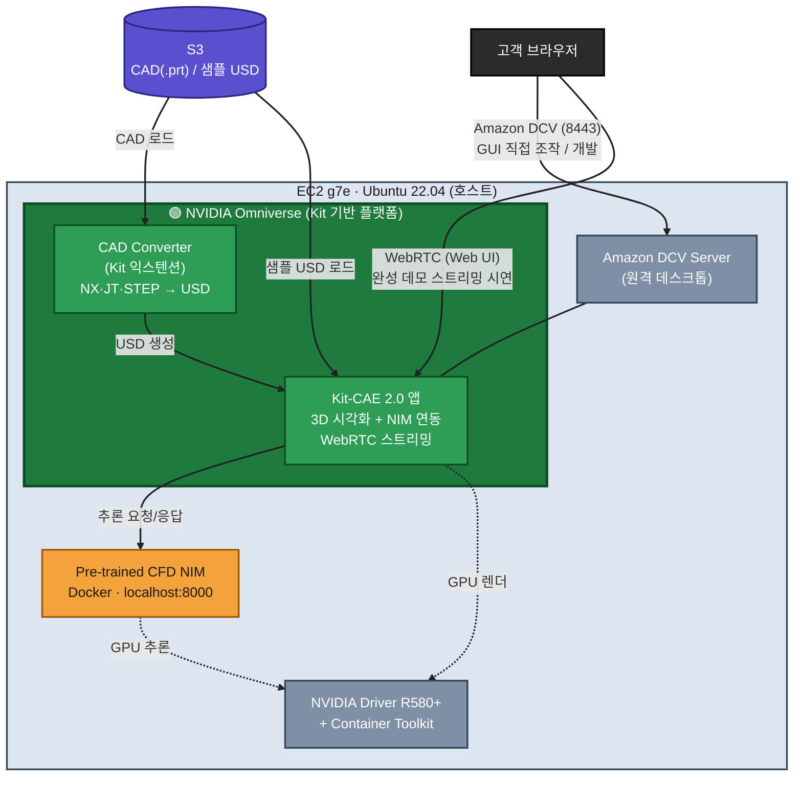

# Omniverse NIM CAE PoC — 최종 사양서

작성 기준일: 2026-05-29 / 비용·가용성은 서울 리전(ap-northeast-2) 실측 반영

---

## 1. 목적

고객에게 AI-Powered CAE 시각화 데모 환경 제공.
Pre-trained CFD NIM(AI 유동해석) + Omniverse Kit-CAE(실시간 3D 렌더링)를 EC2에서 구동,
브라우저로 접속하여 형상 파라미터 변경 → AI 추론 → 압력장/유속 실시간 시각화를 시연.

- 본 PoC = "AI 유동해석 + Omniverse 3D 렌더링 파이프라인이 AWS에서 동작함"을 검증.
- Pre-trained NIM(DoMINO-Automotive-Aero)은 자동차 공력 전용 → 타 도메인 적용은 Phase 2.

---

## 2. 아키텍처

> 초록 영역(NVIDIA Omniverse) = Kit 기반 플랫폼. Kit-CAE 앱과 CAD Converter
> 익스텐션이 모두 그 위에서 동작한다. NIM·DCV·드라이버는 같은 EC2 호스트의
> 별도 컴포넌트.

접근 방식: DCV + WebRTC 둘 다 포함.
- DCV(8443): Kit-CAE GUI 직접 조작·개발·디버깅용.
- WebRTC: 완성 데모를 브라우저로 스트리밍 시연(Blueprint 기본 방식).

---

## 3. 인스턴스 (우선순위)

VRAM 산정: AeroNIM(CFD NIM) ~40GB + Kit-CAE ~15GB ≈ 55GB → 80GB+ 단일 GPU 권장.

| 순위 | 인스턴스 | GPU | VRAM | vCPU | RAM | 비용(서울) | 비고 |
|------|----------|-----|------|------|-----|-----------|------|
| 1 | g7e.4xlarge | RTX PRO 6000 Blackwell ×1 | 96 GB | 16 | 128 GB | $4.916/hr | 단일 GPU로 NIM+Kit 동시. 비용 최적 |
| 2 | g7e.12xlarge | RTX PRO 6000 Blackwell ×2 | 96GB×2 | 48 | 512 GB | $10.187/hr | 멀티 워크로드/다중 세션 시 |
| 3 | g6e.12xlarge | L40S ×4 | 48GB×4 | 48 | 384 GB | $12.900/hr | GPU 분리(Kit=0, NIM=1) |

- 1순위 g7e.4xlarge: 단일 GPU(96GB)로 NIM+Kit 풀스택 구동에 충분, 비용 최적.
- 서울 리전 GPU 가용 용량은 시점·AZ별로 변동 → 배포 직전 재확인 필요.
  가용 부족 시 폴백 순서: g7e.4xl → g7e.12xl → g6e.12xl.

### 용량 사전 확보 (운영 팁)

GPU 인스턴스 가용 용량은 시점·AZ별로 변동하므로, 데모 일정이 확정되면 사전에 용량을
확보하는 것을 권장한다 ("필요할 때 못 잡는" 리스크 방지).

- 데모 전 1대 기동 → `stop`으로 유지 (중지 시 EC2 과금 없음, EBS만 과금).
  - 단 stop은 용량 예약이 아니라 capacity 부족 시 start가 거절될 수 있음.
- 확실한 보장이 필요하면 ODCR(On-Demand Capacity Reservation)로 해당 AZ·타입을
  데모 기간만 예약 후 해제 (예약 시간만큼 인스턴스 단가로 과금).
- AZ 분산: 한 AZ(2a)에서 거절되면 다른 AZ(2b)로 재시도 (서울은 2a/2b).
- 폴백 순서: g7e.4xl → g7e.12xl → g6e.12xl. `instanceType` 파라미터로 즉시 전환.

---

## 4. 소프트웨어 스택

| # | 레이어 | 컴포넌트 | 설치 위치 |
|---|--------|----------|-----------|
| - | OS | Ubuntu 22.04 | EC2 |
| ① | GPU Driver | R580+ (Blackwell/g7e) / R570+ (Ada/g6e) | EC2 (DLAMI 사전설치) |
| ② | Container | Docker + NVIDIA Container Toolkit | EC2 |
| - | NIM | Pre-trained CFD NIM (DoMINO-Automotive-Aero, NGC pull) | EC2 (컨테이너) |
| ④ | Kit 런타임 라이브러리 | Vulkan/GL/X11/폰트/오디오 — 미설치 시 Kit 미기동 | EC2 (apt) |
| - | Kit-CAE | Omniverse Kit-CAE 2.0 (WebRTC 스트리밍 포함) | EC2 (직접 설치) |
| - | CAD Converter | Kit 익스텐션(`omni.kit.converter.*`) — NX/.prt·JT·STEP → USD | Kit 내장(자동 다운로드) |
| ⑥ | Python 3.12 | CAD 변환 headless CLI(`usd-convert-cad`)·USD 스크립팅용 (deadsnakes venv) | EC2 (CLI 변환 시) |
| ⑤ | Remote Access | Amazon DCV Server (구 NICE DCV) + `dcv-gl` | EC2 |
| - | 데이터 | CAD(.prt) / 샘플 USD 데이터 | S3 → EC2 로컬 |

- 계층 번호(①②④⑤⑥)는 CLAUDE.md 섹션 5-0의 패키지 스택과 대응 (③ Kit 빌드 도구는
  kit-app-template 직접 빌드 시에만 — 본 PoC는 Kit-CAE 직접 설치라 선택).
- CUDA Toolkit은 호스트 불필요(Kit 자체 번들, NIM은 컨테이너 내부 포함). 드라이버만 필요.
- ④ Kit 런타임 라이브러리(Vulkan/GL/X11 등)는 설치 필수 — 미설치 시 Kit 미기동(흔한 함정).
- ⑥ Python 3.12는 CAD 변환을 GUI(Kit 내장 Python)로 하면 불필요, headless CLI로 할 때만 설치.

---

## 5. CDK 리소스

| 리소스 | 설정 |
|--------|------|
| VPC | `deploymentMode`로 분기: 운영=private(기존 VPC, 사내망 VPN/DX) / 검증=public(퍼블릭 서브넷) |
| EC2 | g7e.4xlarge(기본), Ubuntu 22.04 DLAMI, EBS 500GB gp3 |
| Security Group | 22(SSH), 8443(DCV), 80/443(Web), WebRTC(49100, 1024/udp, 47995-48012, 49000-49007) |
| IAM Role | S3 읽기/쓰기, ECR pull/push, SSM, Secrets Manager, CloudWatch |
| Secrets | NGC API Key, DCV 비밀번호 (부팅 시 주입) |
| UserData | 드라이버 검증 + Kit 런타임 라이브러리 + DCV + Docker + NIM pull + Kit-CAE 설치 자동화 |

접근 제어 가드레일:
- `allowedCidr` 필수 입력. `0.0.0.0/0`은 합성(synth) 단계에서 차단.
- 운영(private): 사내망 대역. 검증(public): 접속자 IP /32 권장.

---

## 6. 네트워크 — 외부 트래픽 허용 (필수)

사내 폐쇄망/랜딩존에서 외부 트래픽을 막으면 설치/동작 불가.
아웃바운드 443 화이트리스트 등록 필요:

| 도메인 | 용도 |
|--------|------|
| `pypi.nvidia.com` | Kit / 익스텐션 패키지 |
| `*.nvidia.com` (Kit 레지스트리) | Kit 익스텐션 |
| `nvcr.io` + NGC CDN | NIM / 컨테이너 이미지 |
| Ubuntu / Docker apt 미러 | OS 패키지 |

- 운영(private): NAT Gateway 또는 사내 프록시로 위 도메인 허용. S3 VPC Endpoint 권장.
- 폐쇄망 불가피 시: 사전 미러링(사내 ECR + PyPI 미러 + 오프라인 번들).
- 랜딩존 SCP/방화벽/프록시 정책에서 화이트리스트 등록은 인프라팀(DX기술표준팀)과 협의.

---

## 7. 사전 준비

| 항목 | 담당 | 비고 |
|------|------|------|
| NGC API Key | 고객 또는 AWS SA | 무료 키로 충분 (NVAIE 불필요) |
| Pre-trained CFD NIM 이미지 확인 | SA | `nvcr.io/nim/nvidia/domino-automotive-aero` (build.nvidia.com) |
| 샘플 CFD 데이터 (OpenUSD) | NVIDIA 샘플 / 고객 STAR-CCM+ 변환 | Blueprint 샘플(자동차) 기본 제공 |
| 서울 리전 g7e 가용성 | SA | 시점·AZ별 변동 → 배포 직전 재확인 |
| G/VT 온디맨드 vCPU 쿼터 | SA | 코드 `L-DB2E81BA`. g7e.4xl=16 vCPU |
| 외부 도메인 아웃바운드 허용 | 인프라팀(DX) | 위 6항 도메인 화이트리스트 |

배포 머신(로컬): AWS CLI v2, Node.js 18+, AWS CDK v2 (Python 불필요, TypeScript 채택).

---

## 8. 고객 경험 (데모 플로우)

1. 브라우저에서 DCV URL(또는 WebRTC Web UI) 접속
2. Kit-CAE 실행 → 샘플 형상(자동차/날개 등) 로드
3. 형상 파라미터 변경 → CFD NIM에 추론 요청 (수 초)
4. 압력장/유속 결과 실시간 3D 렌더링
5. "대상 도메인 데이터로도 동일 파이프라인 가능" → Phase 2 논의
   - Phase 2: 대상 도메인 CFD 데이터로 커스텀 모델 학습(PhysicsNeMo) 또는 전통 CFD 연동.

> 프로덕션 배포 참고: 본 PoC는 단일 EC2에 NIM 컨테이너를 직접 실행하는 검증용 구성이다.
> 고가용성·오토스케일이 필요한 프로덕션 운영은 NVIDIA 권장 경로인 Amazon EKS
> (Kubernetes + Helm) 또는 Amazon SageMaker(BYOC 엔드포인트)로 이관을 권장한다.
> (출처: docs.nvidia.com/nim — Deploy NIM on AWS)

---

## 9. 비용 (추정)

| 항목 | 비용 | 비고 |
|------|------|------|
| g7e.4xlarge (1순위, 서울) | $4.916/hr | 월 40h ≈ $197 |
| g7e.12xlarge (2순위, 서울) | $10.187/hr | 월 40h ≈ $407 |
| g6e.12xlarge (3순위, 서울) | $12.900/hr | 월 40h ≈ $516 |
| EBS 500GB gp3 | ~$40/월 | 용량 기준 |
| S3 (샘플 데이터) | <$1/월 | |
| 미사용 시 EC2 중지 | $0 (EBS만 과금) | 수동 stop/start |

- 권장(g7e.4xlarge) 월 40시간 사용 시 ≈ $237/월 (인스턴스 $197 + EBS $40).
- 비용은 2026-05-29 서울 리전 온디맨드 기준 → 배포 시점에 재확인 권장.
