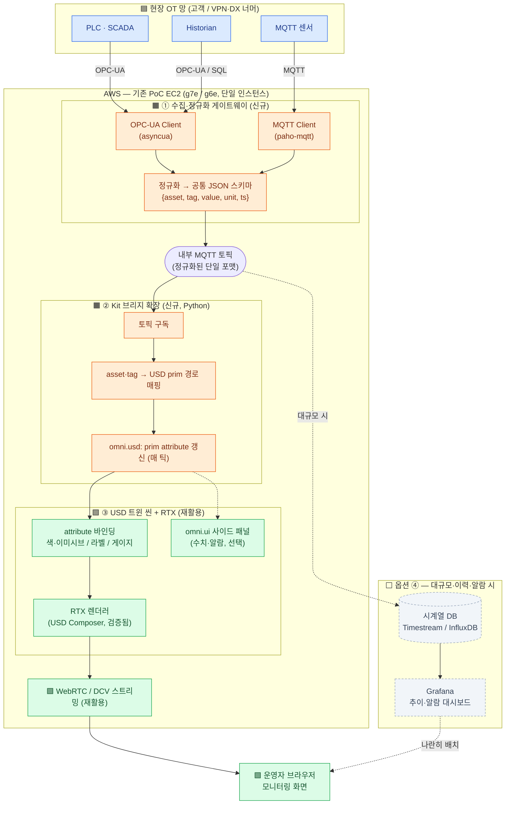
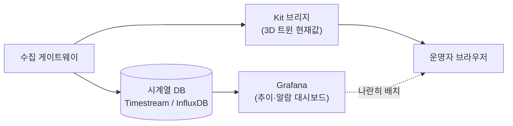

# 디지털 트윈 구축 방안 — 실제(센서) 데이터 연동

작성일: 2026-05-30
전제: 본 문서는 기존 PoC 스택(NVIDIA Omniverse Kit/RTX + DCV/WebRTC, AWS CDK)을
"트윈 뷰·렌더·화면전송" 기반으로 재활용하고, 그 앞단에 OT 센서 데이터 연동
파이프라인을 신규로 붙이는 것을 전제로 한다.
대상 영역: 제조 플랜트 설비 디지털 트윈 모니터링.

> 위치: 현 PoC(CAE 유동해석 시각화) 범위 밖의 확장 과제. 방향 확정 시
> CLAUDE.md "13. 향후 과제"로 승격. (참조: CLAUDE.md 0-0, 0-3, 5-2 RTX 검증)

---

## 0. 한 줄 요약

> RTX 트윈 3D 뷰는 이미 있다(검증 완료). 여기에 PLC/OPC-UA·MQTT·SCADA/Historian
> 센서값을 받아 USD 씬에 실시간 반영하는 "수집 게이트웨이 + Kit 브리지 확장"
> 두 덩어리를 신규 구축하면, 센서값에 따라 설비가 색·수치로 살아나는 모니터링이 된다.

---

## 1. 무엇이 있고, 무엇을 만들어야 하나

| 구성 | 현재 이 PoC | 모니터링 화면에 필요 | 구분 |
|------|-------------|----------------------|------|
| RTX 렌더 트윈 뷰 (Kit/USD Composer) | 있음 (검증됨, 228fps) | 그대로 활용 | 재활용 |
| 화면 전송 (WebRTC / DCV) | 있음 (검증됨) | 그대로 활용 | 재활용 |
| GPU·드라이버·Vulkan·Kit 런타임 | 있음 (CDK 부트스트랩) | 그대로 활용 | 재활용 |
| 센서값 수집·정규화 (OPC-UA/MQTT) | 없음 | 게이트웨이 | 신규 ① |
| 센서값 → USD 반영 (브리지) | 없음 | Kit Python 확장 | 신규 ② |
| 값 표시 (색/라벨/게이지, 알람) | 없음 | USD 바인딩 + omni.ui | 신규 ③ |
| (대규모) 시계열 저장·추이 | 없음 | 시계열 DB + Grafana | 옵션 ④ |

핵심: 3D 트윈 뷰는 공짜로 있다. 센서 연동·값 오버레이·대시보드를 새로 만든다.

---

## 2. 전체 아키텍처

색 구분: 🟦 현장 OT(고객망) · 🟧 신규 구축 · 🟩 기존 PoC 재활용 · ⬜ 옵션(대규모 시)



요약: 신규는 🟧 ①수집 게이트웨이 + ②Kit 브리지 두 덩어리. 씬 바인딩 ③은 🟩 RTX 위에
얹는 작업. 화면전송·렌더·인프라는 모두 재활용. 대규모면 ⬜ ④ 시계열 DB+Grafana를 곁들인다.

---

## 3. ① 수집·정규화 게이트웨이 (OT 프로토콜 → 공통 포맷)

PLC/SCADA/Historian은 대부분 OPC-UA로 통일해 뽑는 것이 정석
(대부분의 SCADA/PLC가 OPC-UA 서버를 제공).

| 소스 | 연동 방식 | 도구 후보 |
|------|-----------|-----------|
| PLC / SCADA | OPC-UA Client 구독(subscription) | `asyncua`(Python), 또는 Kepware/Ignition 게이트웨이 |
| MQTT 센서 | MQTT Subscribe (Sparkplug B 흔함) | `paho-mqtt` |
| Historian | OPC-UA HDA 또는 DB 쿼리 | 벤더별 커넥터 |

- 출력(정규화 스키마 예):
  ```json
  { "asset": "pump_01", "tag": "temperature", "value": 72.5, "unit": "C", "ts": 1717050000 }
  ```
  → 내부 MQTT 토픽으로 발행.
- 이 계층을 따로 두는 이유: 프로토콜 다양성을 여기서 흡수 → 후단 Kit 확장은
  깔끔한 단일 포맷만 구독하면 됨 (결합도↓, 교체 용이).
- 직접 구현(asyncua/paho) vs 기성 게이트웨이(Kepware/Ignition) 선택은 태그 규모와
  벤더 환경에 따라 결정 (섹션 6 참고).

---

## 4. ② Kit 브리지 확장 (정규화 값 → USD 반영)

Omniverse Kit Python 확장 하나로 구현한다. 핵심 로직:

1. 내부 MQTT 토픽 구독 (paho-mqtt를 확장 내부에서 비동기 실행)
2. 메시지의 `asset/tag`를 USD prim 경로에 매핑 (매핑 테이블)
3. `omni.usd` API로 해당 prim의 커스텀 attribute 갱신 (매 틱)
4. 그 attribute를 시각 요소에 바인딩:
   - 머티리얼 emissive 색 (정상=초록 / 경고=주황 / 위험=빨강)
   - 텍스트 라벨 (수치 표시)
   - 게이지 메시 스케일/회전 (아날로그 게이지 표현)
5. (선택) `omni.ui`로 사이드 패널에 수치/추이/알람 위젯

결과: "센서값 올라옴 → 트윈 설비가 색 변하고 옆에 수치 뜸"이 실시간으로 동작.

> 보조: OmniGraph(Action Graph)로 attribute 변화 → 시각 변화(색/애니메이션)를
> 노드 그래프로도 연결 가능. 단순 매핑은 OmniGraph, 복잡한 로직은 Python 확장이 유연.

---

## 5. 이 PoC 스택과의 접점 (인프라 재활용 + 최소 추가)

| 항목 | 현재 | 데이터 연동 위해 |
|------|------|------------------|
| GPU+RTX+Kit+DCV/WebRTC | 있음 | 그대로 |
| Security Group 포트 | 22/8443/WebRTC 군 | MQTT 1883/8883, OPC-UA 4840 추가 (`allowedCidr` 내) |
| 네트워크 경로 | private/public 토글 | 현장 OT망↔EC2 = `private` 모드(VPN/DX)와 정합 |
| 보안 경계 | `allowedCidr`, 0.0.0.0/0 금지 | OT는 단방향(읽기)+DMZ/Historian 경유 권장 |

- OT 보안 원칙: EC2가 현장 PLC에 직접 붙기보다 게이트웨이/Historian 한 단계를
  거치는 것을 권장 (현장망 직결 최소화, 읽기 전용).
- 포트 추가는 CLAUDE.md 섹션 3 SG 정책을 따르되 `allowedCidr` 범위 안에서만 개방.

---

## 6. 규모에 따른 분기 (설계 결정 포인트)

| 태그(포인트) 규모 | 권장 구성 |
|-------------------|-----------|
| 수백 개 | 위 구조 그대로. 단일 EC2에서 게이트웨이 + Kit 확장 동거 OK. 이력 불필요 시 시계열 DB 생략 |
| 수천 ~ 수만 | 시계열 DB(Timestream/InfluxDB) 한 층 추가 + Grafana로 추이/알람 분리. Omniverse는 3D 뷰 전담, 수치/추이 대시보드는 Grafana |

옵션 ④ (대규모 / 추이·알람 필요 시):



- 3D 트윈(현재 상태) + 별도 웹 대시보드(추이/알람)를 나란히 배치하는 조합형.
- 대시보드는 기성품(Grafana) 활용 → 개발량 최소.

---

## 7. 구축 옵션 비교 (통합도 vs 공수)

| 옵션 | 구성 | 장점 | 단점 |
|------|------|------|------|
| A. Omniverse 통합 | 3D 뷰 + 게이지/차트 UI를 Kit 앱 한 화면에 (Kit 확장 개발) | RTX 트윈과 데이터 완전 통합, WebRTC로 그대로 시연 | Kit 확장 개발 공수, 현 PoC 범위 밖 |
| B. 조합형 (현실적) | Omniverse(3D 뷰) + 별도 웹 대시보드(Grafana) 분리 | 대시보드 기성품 활용, 개발 최소 | 3D와 차트가 물리적으로 한 앱은 아님(나란히) |

- 사실적 3D 비주얼이 우선 → A 또는 A+B 혼합.
- 운영 대시보드(수치/추이/알람)가 우선 → B.

---

## 8. 작업량 요약

| 덩어리 | 신규/재활용 | 난이도 |
|--------|-------------|--------|
| ① OT 게이트웨이 (OPC-UA/MQTT 수집·정규화) | 신규 (Python 또는 Kepware/Ignition) | 중 |
| ② Kit 브리지 확장 (USD 갱신) | 신규 (Python, omni.usd/omni.ui) | 중 |
| ③ USD 트윈 씬 바인딩 (색/라벨/게이지) | 신규 (씬 작업) | 하~중 |
| ④ (대규모) 시계열 DB + Grafana | 옵션 | 중 |
| RTX 렌더·화면전송·인프라 | 재활용 | - |

---

## 9. 미확정 / 확인 필요 (Open Questions)

- [ ] 태그(포인트) 규모: 수백 / 수천 / 수만 중? → 시계열 DB·대시보드 분리 여부 결정
- [ ] 이력·추이·알람 필요 여부 → 옵션 ④(시계열 DB+Grafana) 도입 판단
- [ ] 현장 접점: PLC/SCADA에 OPC-UA 서버가 이미 있는가, 아니면 Kepware/Ignition
      게이트웨이를 둘 수 있는가
- [ ] OT망 ↔ AWS 경로(VPN/DX) 확보 여부 → `private` 모드 전제
- [ ] 구축 옵션 A(Omniverse 통합) vs B(조합형) 우선순위
- [ ] 데이터 방향: 모니터링(읽기 전용)만인가, 향후 제어(쓰기)까지 갈 것인가 (보안 영향)

---

## 10. 결론

- 트윈 3D 뷰·RTX 렌더·화면전송은 이미 검증된 자산 → 재활용.
- 신규 구축은 ① 수집 게이트웨이, ② Kit 브리지 확장, ③ 씬 바인딩 세 덩어리.
- 대시보드가 필요하면 Grafana로 분리(조합형)가 현실적.
- 규모(태그 수)와 이력 필요 여부가 시계열 DB 도입의 분기점.
- 본 방안은 현 PoC 확장 과제 → 방향 확정 시 CLAUDE.md 13으로 승격.
